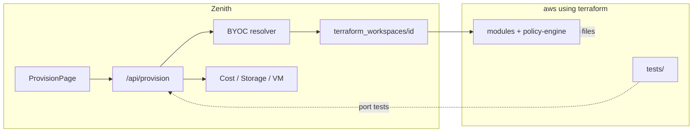

# AWS Terraform ↔ Zenith Integration Plan

> **Phase 14 deliverable** · Compared repos: `CloudResourceOptimizationPlatform` (Zenith) vs `aws using terraform`  
> **Decision record:** [DEC-019](DECISIONS.md) — merge already started; this doc completes the gap analysis and roadmap.

---

## Executive summary

**Is integration a good idea?** **Yes — and it is already partially done.** Zenith copied the Terraform modules, policy engine, and provision API per DEC-019. The standalone `aws using terraform` project remains the **reference implementation** (308 tests, dedicated ops UI, CLI wizard). Zenith should **not** become a second copy of that repo; it should **finish the merge** where it adds product value (BYOC, unified auth, cost/ML/storage context) and **skip** what duplicates Zenith’s stack or violates zero-cost constraints.

**Recommended strategy:** Treat `aws using terraform` as an **upstream module + behavior spec**. Sync Terraform/policy files on a schedule; port **missing behaviors** into `app/provision/` and `ProvisionPage.jsx`; do **not** port the Next.js app or GitHub-only team auth.

---

## What each project is

| Dimension | **Zenith** | **aws using terraform** |
|-----------|------------|-------------------------|
| Primary goal | Cloud resource **optimization** (storage tiering, ML, cost, security, VMs) | **Provision & govern** AWS infra via Terraform |
| UI | React + Vite (`ProvisionPage.jsx`) | Next.js 6-page dashboard |
| Auth | JWT + MongoDB users | GitHub token + `teams.yaml` |
| AWS creds | BYOC (encrypted in MongoDB, STS for IAM role) | Single-account / Phase 17 BYOC planned |
| Terraform | `backend/terraform/` + per-user workspaces | Root `main.tf` + modules |
| Tests | 46 pytest (no dedicated provision suite) | 308 pytest (policy, wizard, drift, web API, terminal) |
| Maturity | Provision **wired** but **under-tested** | Provision **complete** as standalone product |

---

## Already integrated (do not re-port)

These are present in Zenith and align with the source project:

| Capability | Zenith location | Source equivalent |
|------------|-----------------|-------------------|
| 7 Terraform modules (VPC, EC2, S3, IAM, CloudWatch, Billing, DynamoDB) | `backend/terraform/modules/*` | `modules/*` |
| Root `main.tf` wiring | `backend/terraform/main.tf` | `main.tf` |
| YAML policy engine (8 rules) | `backend/terraform/policy-engine/rules.yaml` | `policy-engine/rules.yaml` |
| OPA Rego policies | `backend/terraform/opa-policies/aws_security.rego` | `opa-policies/` |
| Terraform CLI wrapper (init/plan/apply/destroy, SSE stream) | `terraform_runner.py` | subprocess in `server.py` / wizard |
| tfvars generation | `write_tfvars()` | `wizard.py` / `_config_to_tfvars` |
| 4-step provision wizard + templates | `ProvisionPage.jsx` | `deploy/page.tsx` |
| Policy check + cost estimate before deploy | `/provision/policy-check`, `/estimate` | deploy flow |
| Drift detect + remediate (API) | `drift_detector.py`, deployment cards | `drift/page.tsx`, `remediation.py` |
| RBAC + audit API | `rbac.py`, `audit_logger.py`, `/roles`, `/audit-log` | `team_engine.py`, `audit.py` |
| Celery scheduled drift | `tasks.py` @ 06:00 UTC | GitHub Actions cron |
| BYOC for apply/plan | `_resolve_byoc_credentials()` | Phase 17 (not started in source) |
| Infracost + free-tier fallback | `cost_estimator.py` | CI + wizard gates |

**Maintenance rule:** When fixing modules or rules in the source repo, **copy/sync** into `backend/terraform/` (not git submodule — per DEC-019).

---

## Feasible to adopt (high value)

Prioritized for Zenith’s optimization platform narrative.

### P0 — Correctness & trust (do first)

| # | Feature | Why it fits Zenith | Work |
|---|---------|-------------------|------|
| 1 | **Provision test suite** | Source has 100+ provision tests; Zenith has **zero** `tests/test_provision*`. Regressions are invisible. | Port/adapt mocked-subprocess tests from source `tests/` for policy, cost, rbac, plan/apply guards. |
| 2 | **Scheduled drift + BYOC** | `tasks.py` admits drift runs **without** user BYOC creds — wrong for multi-tenant. | Store deployment-scoped credential reference; resolve BYOC in Celery task (or disable schedule until BYOC present). |
| 3 | **Terraform module sync CI** | Drift between copies causes silent bugs. | Add job: `terraform validate` on `backend/terraform/` + diff check vs source (manual or scripted). |
| 4 | **PageHeader + design tokens on Provision** | Phase 13 parity; page exists but polish backlog called it out. | UI pass only — align with `DESIGN_SYSTEM.md`. |

### P1 — Product cohesion (optimization story)

| # | Feature | Why it fits Zenith | Work |
|---|---------|-------------------|------|
| 5 | **Post-deploy → Cost Optimization link** | User provisions EC2/S3; Zenith should surface cost/rightsizing for those resources. | After apply, write resource IDs to `cost_data` / show CTA on deployment card. |
| 6 | **Post-deploy → VM Cluster** | EC2 template maps to existing `vm_assignments` story. | Optional: register instance metadata from terraform outputs into VM module. |
| 7 | **Provision audit UI** | API exists (`GET /provision/audit-log`); no dashboard page. | Tab on Provision or Admin: filterable audit table (reuse patterns from `AuditLogPanel`). |
| 8 | **Admin provision RBAC UI** | API `POST /roles/assign`, `GET /roles` — no UI. | Settings or Admin sub-page for provision roles (viewer/operator/admin). |
| 9 | **Policy rules viewer** | Source has `/policies` page; Zenith only shows check results inline. | Read-only list from `get_yaml_rules()` + OPA status in Provision step 3. |
| 10 | **Drift dashboard panel** | Drift buttons on cards only; source has dedicated drift page with history. | Expand deployment detail: last drift report, remediate with `check_only` toggle (API already supports). |

### P2 — Nice-to-have (if time)

| # | Feature | Why | Work |
|---|---------|-----|------|
| 11 | **SSE streaming for plan/apply** | `terraform_runner.plan_stream` exists; UI uses buffered output. | Wire EventSource in `ProvisionPage` step 4. |
| 12 | **Slack/email drift alerts** | Source drift workflow notifies Slack. | Optional webhook in settings; Celery task posts on `DRIFT_DETECTED`. |
| 13 | **Destroy guardrails** | Source enforces destroy after tests. | Confirm modal + budget reminder; block destroy if policy blocks re-apply. |
| 14 | **Template tfvars in UI** | `backend/terraform/templates/*.tfvars` exist. | Pre-fill wizard from template files via API. |

---

## Do not adopt (or defer indefinitely)

| Feature (source project) | Reason to skip in Zenith |
|--------------------------|--------------------------|
| **Entire Next.js web-ui** | Zenith is React/Vite; duplicating UI wastes effort. Port **behaviors**, not pages. |
| **GitHub token login + `teams.yaml`** | Conflicts with JWT/MongoDB auth (DEC-004). Use `provision_roles` in MongoDB only. |
| **CLI wizard (`cli-wizard/wizard.py`)** | Zenith is web-first; CLI adds maintenance, no user ask. |
| **Remote S3 backend per org (hardcoded bucket)** | Source `backend.tf` uses account-specific bucket `terraform-state-412628362844`. Zenith correctly uses **isolated local workspaces** per deployment; remote state is an **enterprise** option later (BYOC bucket), not copy-paste. |
| **Web Terminal / CloudShell (Phase 16)** | High security surface; requires persistent WS + session isolation. Defer unless enterprise tier; not core to optimization. |
| **Separate FastAPI on port 8000** | Zenith already mounts `/api/provision` on main app — do not run second API. |
| **308-test monolith in one PR** | Port incrementally; target 40–60 focused provision tests first. |
| **GitHub Actions terraform apply from repo** | Zenith deploys via user BYOC from UI — CI should only `validate`, not `apply` to AWS. |
| **Duplicate billing module alerts** | Zenith has `BillingPage` + budgets collection; avoid two budget systems — link provision `budget_limit` to existing budgets. |

---

## Gap analysis: source pages → Zenith

| Source UI (`web-ui/frontend`) | Zenith equivalent | Status |
|------------------------------|-------------------|--------|
| `/deploy` wizard | `ProvisionPage.jsx` 4-step | ✅ Done |
| `/drift` | Drift on deployment cards | 🟡 Partial — no history view |
| `/audit` | Security `AuditLogPanel` only | 🟡 API only — provision audit separate |
| `/policies` | Inline step 3 results | 🟡 Partial |
| `/team` | N/A (MongoDB RBAC API) | 🔲 Admin UI missing |
| `/terminal` | N/A | ⛔ Deferred |
| `/settings` | `SettingsPage` (BYOC) | ✅ BYOC stronger in Zenith |
| `/login` (GitHub) | Zenith auth | ⛔ Different model — intentional |

---

## Architecture: how integration should work

**Principles**

1. **Single UI, single API** — no parallel Next.js stack.
2. **BYOC always** for mutating terraform — never server-wide AWS keys in production.
3. **Policy before apply** — non-negotiable (already enforced).
4. **Optimization hooks** — provision is an **on-ramp**, not a silo; tie outputs to cost/VM/storage.
5. **Sync, don’t fork** — periodic copy of `modules/` and `policy-engine/` from source.

---

## Phased roadmap

| Phase | Scope | Est. effort |
|-------|--------|-------------|
| **14a** (this doc) | Feasibility + adopt/skip matrix | ✅ Done |
| **14b** | P0: tests + BYOC drift + validate CI | ✅ Complete 2026-05-29 |
| **14c** | P1: audit/RBAC UI + drift panel + PageHeader | 2–3 days |
| **14d** | P1: cost/VM linkage after deploy | 3–5 days |
| **14e** | P2: SSE stream, alerts | optional |

---

## Verdict

| Question | Answer |
|----------|--------|
| Good idea to integrate? | **Yes** — aligns with “provision → optimize” user journey and DEC-019. |
| Start from scratch? | **No** — ~70% of core provision stack already merged. |
| Keep standalone repo? | **Yes** — as reference/tests/modules upstream; avoid dual UIs in production. |
| Biggest risk? | Untested provision path + scheduled drift without BYOC. Fix P0 before marketing provision feature. |

---

## References

- `ai-docs/DECISIONS.md` — DEC-019
- `backend/app/provision/` — runtime implementation
- `frontend/src/pages/ProvisionPage.jsx` — user wizard
- External: `/Users/a.prithiviraj/Documents/Projects/aws using terraform/` — Phases 1–16 complete, Phase 17 BYOC planned

_Last updated: 2026-05-29_
